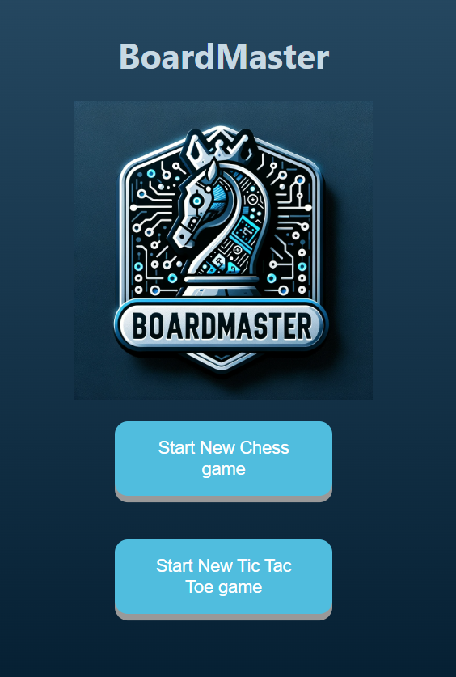
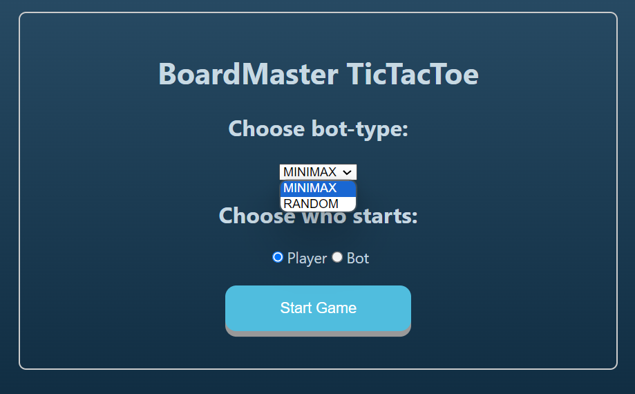
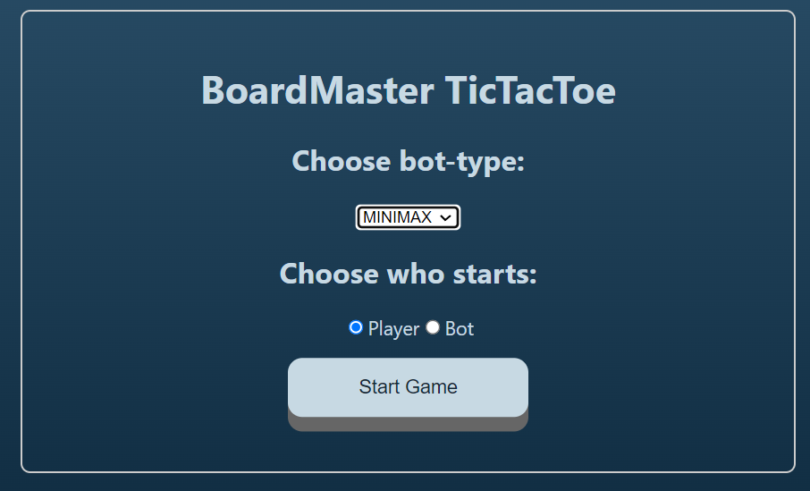
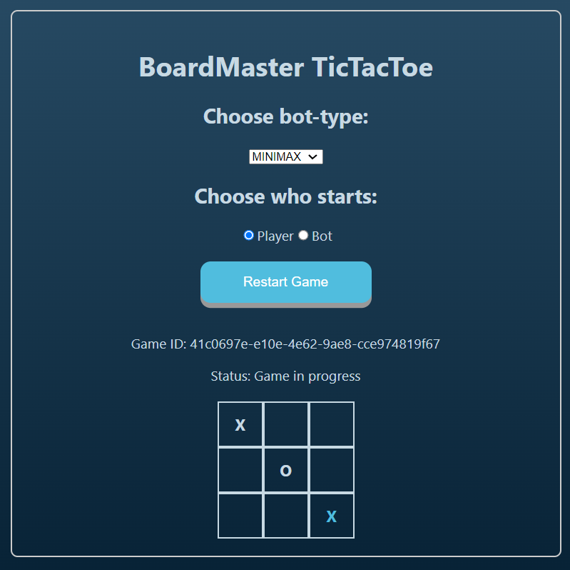
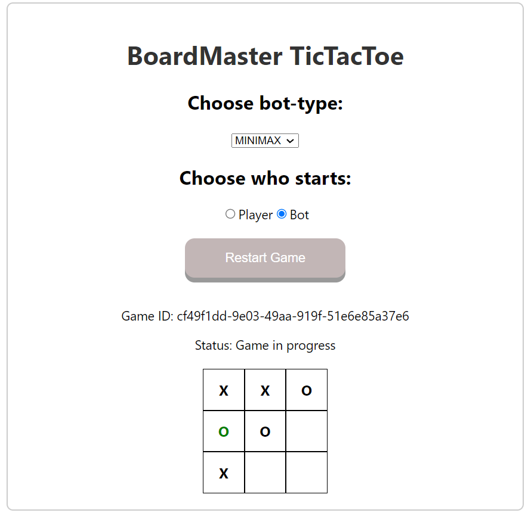
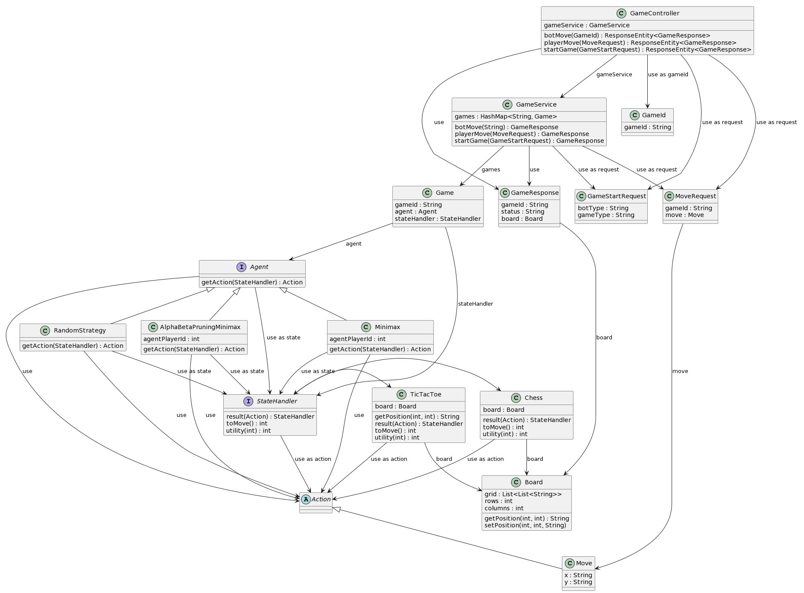

# board-master
<div align="center">


[](https://opensource.org/licenses/MIT)
[](https://img.shields.io/badge/version-0.0.1-blue)


</div>

<details> 
<summary><b>📋 Table of contents </b></summary>

- [board-master](#board-master)
  - [Introduction](#introduction)
    - [What is BoardMaster?](#what-is-boardmaster)
      - [Main-menu:](#main-menu)
      - [TicTacToe-menu:](#tictactoe-menu)
      - [TicTacToe game:](#tictactoe-game)
    - [Minimax Algorithm](#minimax-algorithm)
  - [Setup](#setup)
    - [Prerequisites](#prerequisites)
      - [Frontend:](#frontend)
      - [Backend:](#backend)
        - [Docker:](#docker)
        - [Manual:](#manual)
  - [Installation](#installation)
    - [1. Clone the repository](#1-clone-the-repository)
    - [2. Navigate to the Project Directory:](#2-navigate-to-the-project-directory)
    - [Frontend](#frontend-1)
      - [**Start node package manager:**](#start-node-package-manager)
    - [Backend](#backend-1)
      - [Build the backend with docker:](#build-the-backend-with-docker)
        - [**Start backend:**](#start-backend)
      - [Build the backend manually:](#build-the-backend-manually)
      - [**Start backend:**](#start-backend-1)
  - [Tests](#tests)
    - [Frontend](#frontend-2)
    - [Backend](#backend-2)
  - [Code Coverage](#code-coverage)
  - [Documentation](#documentation)
  - [Contributors](#contributors)
  - [License](#license)

</details>

## Introduction

### What is BoardMaster?
BoardMaster is a full-stack application designed for players to enjoy various board games against a range of bots, such as RandomMoveAgent, MiniMaxAgent, and others. It offers an immersive gaming experience, combining classic board game fun with modern AI technology.

#### Main-menu:
<div align="center"> 
  
</div>

#### TicTacToe-menu:

<div style="display: flex;" align="center">
  
  
</div>

#### TicTacToe game:
<div style="display: flex;" align="center">
  
  
</div>

### Minimax Algorithm
The games this algorithm works great for are what game theorists call deterministic , two-player turn-taking, perfect information, zero-sum games. These games are "fully observable", meaning that you can see everything that is going on in the game. They are also "deterministic", meaning that there is no element of chance involved in the game. There is no dice rolling or card drawing. The game is "zero-sum", meaning that one player's gain is the other player's loss. In other words, if you add up all the gains and losses for each player, they will sum to zero. Finally, the game is "turn-taking", meaning that the players alternate making moves, and "perfect information", meaning that no information is hidden from either player. Chess, checkers, tic-tac-toe, Go, and Othello are all examples of deterministic, two-player, turn-taking, perfect information, zero-sum games. However games that has too many possible moves, such as chess, will take too long to compute and will not be feasible to use this algorithm on.


## Setup
To setup the project, one needs to have all the prerequisites installed. Clone the repository, install the dependencies and build the project. This is described in more detail below.

### Prerequisites
Before setting up BoardMaster, ensure that your system meets the following requirements:
<ul> 

Ensure that git is installed on your machine. [Download Git](https://git-scm.com/downloads)

</ul>

#### Frontend:

<ul>
  <details> <summary><b> Node.js 16 or higher (Download from Node.js website) </b></summary>
  BoardMaster requires Node.js to be installed. The project is tested with Node.js 16 and Node.js 20, but it should work fine with any version 16 or higher.
</ul>

#### Backend:
For the backend, one can use docker or install the prerequisites manually.

##### Docker:
Need to have docker installed on your machine. [Download Docker](https://www.docker.com/products/docker-desktop)

##### Manual:
<ul>
  <details> <summary><b> Java JDK 17 or higher (Download from Oracle's website) </b></summary>
  BoardMaster requires Java JDK to be installed. The project is tested with JDK 17, but it should work fine with any version 17 or higher.

  * Java JDK 17 or higher - Java Development Kit is essential for compiling and running Java applications.
    * Download and install it from Oracle's Java JDK Download Page or adopt an open-source JDK like AdoptOpenJDK.
    * After installation, verify the installation by running ```java -version``` and ```javac -version``` in your command line or terminal.
  </details>
</ul>
<ul>
  <details> 
  <summary><b> Gradle 8 or higher </b></summary>
  Gradle is used as the build tool for BoardMaster. It automates the process of building, testing, and deploying the application.

  * Gradle 8 or higher - Gradle brings advanced build toolkit to manage dependencies and other aspects of the build process.
    * You can download Gradle from the Gradle Download Page.
    * Alternatively, if you are using a Gradle Wrapper script (gradlew or gradlew.bat), you do not need to manually install Gradle, as the wrapper script will handle the installation for you.
    * To confirm that Gradle is properly installed, run ```gradlew -v``` in your command line or terminal which will display the installed Gradle version.
  </details>
</ul>
Ensure that both Java and Gradle are properly installed and configured in your system's PATH environment variable for seamless execution of BoardMaster.

## Installation
Follow these steps to set up BoardMaster on your local machine:

### 1. Clone the repository
```cmd
git clone https://github.com/SverreNystad/board-master.git
```

### 2. Navigate to the Project Directory:
After cloning, move into the BoardMaster project directory:
```cmd
cd board-master
```

### Frontend
Install node package manager
```cmd
npm install
```

#### **Start node package manager:**
```cmd
npm start
```
After starting the node package manager, the frontend should be available at http://localhost:3000/ and should pop up in your default browser.

### Backend
#### Build the backend with docker:

*Note: Remember that `cmd` uses `gradlew` and `bash` uses `./gradlew`.*

```cmd
gradlew bootBuildImage --imageName=cogito/boardmaster
```

##### **Start backend:**
```cmd
docker run -p 8080:8080 -t cogito/boardmaster 
```
After starting the backend, the backend should be available at http://localhost:8080/

#### Build the backend manually:
Inside the project directory `backend`, use Gradle to build the project:
```cmd
gradlew build
```
This command compiles the project and downloads all necessary dependencies.


#### **Start backend:**

To run the project, run the following command in the root directory of the project:
```cmd
gradlew bootRun
```

## Tests
### Frontend
No tests yet

### Backend
To run all the tests, run the following command in the `backend` directory of the project:
```cmd
gradlew test
```

## Code Coverage
To generate a code coverage report, use the following Gradle command in `backend` directory of the project:

```cmd
gradlew test jacocoTestReport
```

## Documentation
To generate the documentation, use the following Gradle command in `backend` directory of the project:

```cmd
gradlew buildClassDiagram
```
This will create a `class-diagram` in the `docs` directory of the project. Open the `backend.plantuml` file in [Plant Uml editor](https://www.planttext.com/) to view the documentation.


## Contributors
<table align="center">
  <tr>
    <td align="center">
        <a href="https://github.com/JonBergland">
            <br />
            <sub><b>Jon Bergland</b></sub>
        </a>
    </td>
    <td align="center">
        <a href="https://github.com/SverreNystad">
            <br />
            <sub><b>Sverre Nystad</b></sub>
        </a>
    </td>
  </tr>
</table>

## License
Licensed under the [MIT License](LICENSE).

