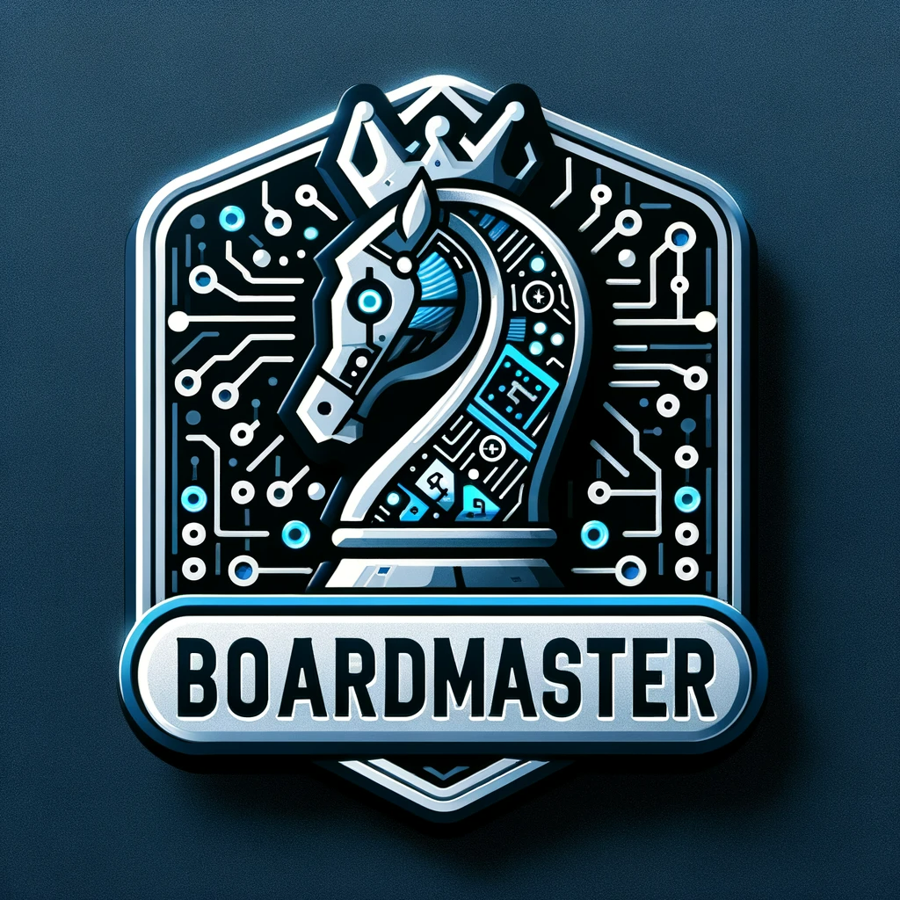

# board-master
<div align="center">


[](https://opensource.org/licenses/MIT)
[](https://img.shields.io/badge/version-0.0.1-blue)


</div>

<details> 
<summary><b>📋 Table of contents </b></summary>

- [board-master](#board-master)
  - [Introduction](#introduction)
    - [Minimax Algorithm](#minimax-algorithm)
    - [Planned Features](#planned-features)
  - [Setup](#setup)
    - [Prerequisites](#prerequisites)
  - [Setup](#setup-1)
    - [1. Clone the repository](#1-clone-the-repository)
    - [2. Navigate to the Project Directory:](#2-navigate-to-the-project-directory)
    - [3. Build the Project:](#3-build-the-project)
  - [Usage](#usage)
  - [Tests](#tests)
  - [Code Coverage](#code-coverage)
  - [Contributors](#contributors)
  - [License](#license)

</details>

## Introduction


### Minimax Algorithm
The games this algorithm works great for are what game theorists call deterministic , two-player turn-taking, perfect information, zero-sum games. These games are "fully observable", meaning that you can see everything that is going on in the game. They are also "deterministic", meaning that there is no element of chance involved in the game. There is no dice rolling or card drawing. The game is "zero-sum", meaning that one player's gain is the other player's loss. In other words, if you add up all the gains and losses for each player, they will sum to zero. Finally, the game is "turn-taking", meaning that the players alternate making moves, and "perfect information", meaning that no information is hidden from either player. Chess, checkers, tic-tac-toe, Go, and Othello are all examples of deterministic, two-player, turn-taking, perfect information, zero-sum games. However games that has too many possible moves, such as chess, will take too long to compute and will not be feasible to use this algorithm on.

### Planned Features

## Setup
To setup the project, one needs to have all the prerequisites installed. Clone the repository, install the dependencies and build the project. This is described in more detail below.

### Prerequisites
- Ensure that git is installed on your machine. [Download Git](https://git-scm.com/downloads)
- Java JDK 17 or higher (Download from Oracle's website)


## Setup
Follow these steps to set up BoardMaster on your local machine:

### 1. Clone the repository
```cmd
git clone https://github.com/SverreNystad/board-master.git
```

### 2. Navigate to the Project Directory:
After cloning, move into the BoardMaster project directory:
```cmd
cd board-master
```

### 3. Build the Project:
Inside the project directory, use Gradle to build the project:
```cmd
gradlew build
```
This command compiles the project and downloads all necessary dependencies.


## Usage
To run the project, run the following command in the root directory of the project:
```cmd
gradlew run
```

## Tests
To run all the tests, run the following command in the root directory of the project:
```cmd
gradlew test
```

## Code Coverage
To generate a code coverage report, use the following Gradle command:

```cmd
gradlew test jacocoTestReport
```

## Contributors
<table align="center">
  <tr>
    <td align="center">
        <a href="https://github.com/JonBergland">
            <br />
            <sub><b>Jon Bergland</b></sub>
        </a>
    </td>
    <td align="center">
        <a href="https://github.com/SverreNystad">
            <br />
            <sub><b>Sverre Nystad</b></sub>
        </a>
    </td>
  </tr>
</table>

## License
Licensed under the [MIT License](LICENSE).

